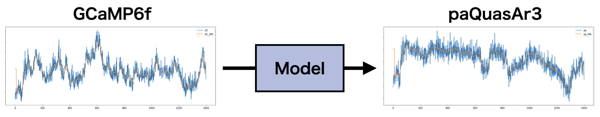
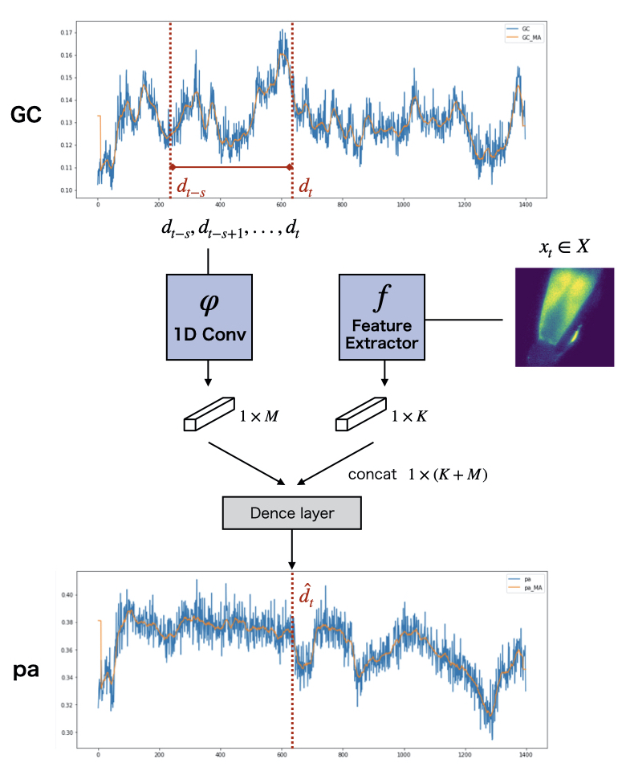
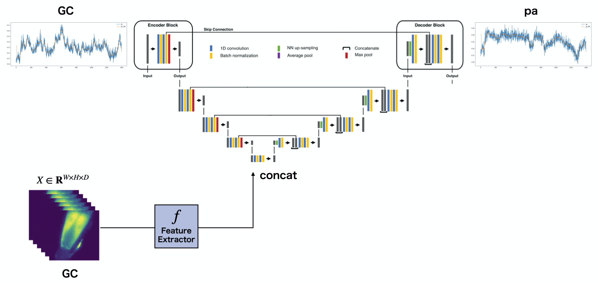

This is a repository for waveform prediction. 

Tensorflow/Keras implementation.

## Run

```shell
python main.py \
    --DATA_TRAIN_LIST [Dates of Training Data] \
    --DATA_TEST_LIST  [Dates of Test Data] \
    --SAVE_PATH [Path to saving folder] \
    --pred_type ['Many2Many', 'Many2One'] \
    --model [Model name] \
    --augment [Whether to apply data augmentation]\
    --batchsize [Batch size of training] \
    --epochs [Epochs of training]

```

Recommend to use .sh file, see `main.sh`.

**Example**

- Many to Many Prediction

  ```shell
  python main.py \
      --DATA_TRAIN_LIST 0323-1 0323-2 0323-3 0323-4 0323-5 0323-6 0323-7 0323-8 0323-9 0323-10 0323-11 0323-12 \
      --DATA_TEST_LIST  0324-1 0324-2 0324-3 0324-4 0324-5 0324-6 0324-7 0324-8 0324-9 0324-10 0324-11 0324-12 \
      --SAVE_PATH ./Result \
      --pred_type Many2Many \
      --model Utime \
      --augment \
      --batchsize 64 \
      --epochs 300
  ```
  
  To add movie feature in Utime, add a below option. 
  
  ResNet18 feature extraction will be applied. (As of 2021/07/02)
  
  ```shell
  --input_movie
  ```

- Many to One Prediction

  ```shell
  python main.py \
      --DATA_TRAIN_LIST 0323-1 0323-2 0323-3 0323-4 0323-5 0323-6 0323-7 0323-8 0323-9 0323-10 0323-11 0323-12 \
      --DATA_TEST_LIST  0324-1 0324-2 0324-3 0324-4 0324-5 0324-6 0324-7 0324-8 0324-9 0324-10 0324-11 0324-12 \
      --SAVE_PATH ./Result \
      --pred_type Many2One \
      --model  \
      --augment \
      --batchsize 64 \
      --epochs 300
  ```

  To add image feature in Convolution model, add options as shown in the following example. 

  ```shell
  --input_image \
  --image_model ResNet50 \
  --image_model_pretrained
  ```

### Get Keras Model for other purpose.

To obtain a time series model, follow the example code. You can use models in `model.py` for other purposes.

```python
model = WaveModel(N_SEQUENCE=200, 
                	N_FEATURE=1, 
                	IMG_SHAPE=(256,256,1),
                	image_model="ResNet18",
                	pretrained=False).build.model()
model.compile("adam",loss="mse")
```


## Models

List of models in model.py. 

### Many to One

- LSTM model
- RNN model
- GRU model
- Conv model
- Conv + image feature model

### Many to Many

- LSTM Encoder-Decoder model
- GRU Encoder-Decoder model
- Convolution Encoder-Decoder model
- Utime
- Utime + Movie feature

#### Conv + image feature model



#### Utime + Movie feature



